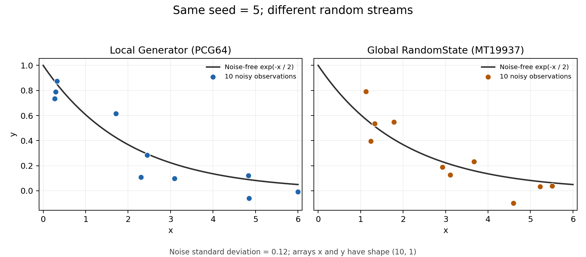

# 02 — What is a practical way to insert images into Markdown?

[Back to the handbook](../README.md)

## Question

> How should I insert screenshots or figures into a `.md` file and organize their image files?

**For this repository, save images in `docs/images/` and reference them with relative paths.** This keeps a chapter and its figures portable when the repository is copied or cloned.

## 1. Save the image, then reference it

The repository already contains this example:

```text
research-coding-handbook/
├── README.md
└── docs/
    ├── 01-main-spyder-function-inspection.md
    ├── 02-main-markdown-images.md
    └── images/
        └── 01-generated-data.png
```

In a chapter inside `docs/`, write:

```markdown

```

In the root `README.md`, write:

```markdown

```

The path starts from the directory containing the Markdown file. In these examples, `images/` means a child directory and `../` would mean one directory up. Use forward slashes `/` in links, including on Windows. The text in brackets is **alternative text**, a short description of the image. See [GitHub: images and relative links](https://docs.github.com/en/get-started/writing-on-github/getting-started-with-writing-and-formatting-on-github/basic-writing-and-formatting-syntax#images).

## 2. See an actual embedded figure


*Figure: Both versions use seed 5, ten observations, and noise standard deviation 0.12.*

The image above is a real file generated from the [Q1 example](../examples/01_spyder_function_inspection.py). To regenerate it from the repository root, use an environment with NumPy and Matplotlib:

```text
python examples/02_plot_generated_data.py
```

The script writes `docs/images/01-generated-data.png`; running it again updates that figure.

## 3. Insert a Spyder screenshot in VS Code

1. Capture the relevant Spyder panes and save the screenshot as a PNG in `docs/images/`, for example `01-spyder-local-breakpoint.png`.
2. Open the intended `.md` file. Run **Markdown: Insert Image from Workspace** from the command palette and select the saved image. Alternatively, drag it over the Markdown editor, then hold **Shift** as you drop it.
3. Add descriptive alternative text and a short caption stating where execution paused and what the image demonstrates.
4. On Windows, press **Ctrl+Shift+V** to preview the Markdown, or press **Ctrl+K**, then **V**, for a preview beside the editor.

Pasting image data is also supported. Check where the editor saved the image; VS Code's `markdown.copyFiles.destination` setting controls that destination. See [VS Code: Markdown images and preview](https://code.visualstudio.com/docs/languages/markdown).

For Q1, a useful screenshot shows the paused `return x, y` line and the Variable Explorer entries for `x`, `y_true`, `noise`, and `y` together.

## 4. Control display width when needed

For a renderer that supports raw HTML, you can use:

```html

```

Here the path is for a Markdown file inside `docs/`; a root README needs `docs/images/01-generated-data.png`. HTML rendering varies by viewer, so check the target preview. Ordinary Markdown image syntax is the more portable starting point.

## 5. File and Git conventions

- Use descriptive filenames, such as `01-spyder-local-breakpoint.png`. PNG is a practical choice for screenshots; for generated plots, retain the script so labels or resolution can be changed later.
- Keep the image and its Markdown reference together in version control when the image should be shared. Ignoring a Markdown file does not automatically ignore the images it references.
- The two language versions can reference the same image; each supplies its own alternative text and caption. This repository tracks both language versions, their HTML/PDF print editions, and the shared example PNG in Git.
- If an image does not display, check that it exists, that the path is relative to the current `.md` file, and that filename capitalization matches. Also check that you wrote ``: omitting `!` produces a link instead of an image.
